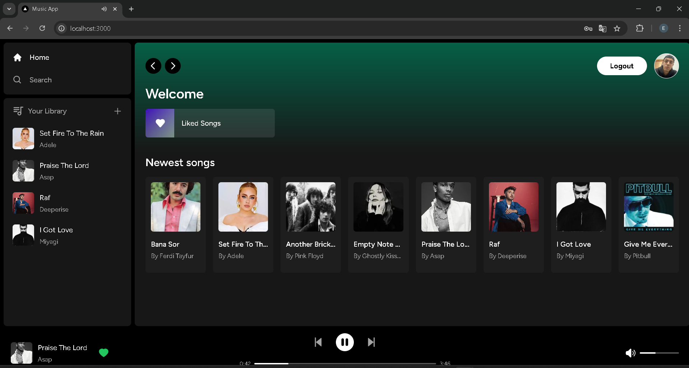
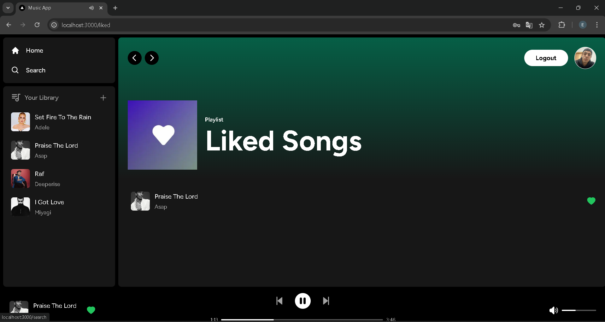

Aşağıda projeniz için Türkçe bir **README.md** dosyası oluşturulmuştur:

# Müzik Dinleme Uygulaması 🎵

Bu proje, kullanıcıların favori şarkılarını keşfetmesini, organize etmesini ve modern bir platformda dinlemesini sağlayan bir müzik dinleme platformudur. **Next.js**, **React**, **TailwindCSS**, **Supabase** ve **PostgreSQL** gibi güncel teknolojiler kullanılarak inşa edilmiştir ve kullanıcı dostu bir arayüz ile optimize edilmiş performans sunmayı hedefler.

---

## 🚀 Özellikler

- **Kullanıcı Girişi**: Güvenli kayıt olma ve giriş yapma özellikleri.
- **Müzik Arama**: Şarkı ve sanatçıları hızlı bir şekilde arama.
- **Çalma Listeleri**: Çalma listeleri oluşturma, yönetme ve organize etme.
- **Müzik Çalma**: Platform üzerinden müzik dinleme.
- **Favoriler**: Şarkıları beğenip hızlı erişim için kaydetme.
- **Responsive Tasarım**: Tüm ekran boyutlarına uygun tamamen optimize edilmiş tasarım.

---

## 🛠️ Kullanılan Teknolojiler

- **Next.js**: Sunucu tarafı render (SSR) ve routing için React tabanlı framework.
- **React**: Bileşen tabanlı kullanıcı arayüzü geliştirme.
- **TailwindCSS**: Stil yönetimi için utility-first CSS framework.
- **Supabase**: Kimlik doğrulama ve veritabanı yönetimi için açık kaynaklı backend.
- **PostgreSQL**: Etkin veri depolama için güçlü ilişkisel veritabanı.
- **RESTful API'lar**: Backend ve frontend arasında veri alışverişi.

---

## 📂 Proje Yapısı

/components # Tekrar kullanılabilir arayüz bileşenleri
/hooks # Özel React hook'ları
/pages # Uygulama sayfaları
/styles # TailwindCSS stil dosyaları
/utils # Yardımcı fonksiyonlar
/public # Görseller ve genel varlıklar

````


## ⚙️ Kurulum
1. Depoyu klonlayın:
   ```bash
   git clone https://github.com/ErenVys/music-app.git
````

2. Proje dizinine gidin:
   ```bash
   cd muzik-dinleme-uygulamasi
   ```
3. Bağımlılıkları yükleyin:
   ```bash
   npm install
   ```
4. Geliştirme sunucusunu başlatın:
   ```bash
   npm run dev
   ```

---

## 🌐 Ortam Değişkenleri

Proje kök dizininde bir `.env` dosyası oluşturun ve aşağıdaki ortam değişkenlerini ekleyin:

```
NEXT_PUBLIC_SUPABASE_URL=<Supabase URL'iniz>
NEXT_PUBLIC_SUPABASE_ANON_KEY=<Supabase Anon Key'iniz>
```

---

## 🎨 Ekran Görüntüleri

| Özellik            | Görsel                                          |
| ------------------ | ----------------------------------------------- |
| Ana Sayfa          |           |
| Beğenilen Şarkılar |  |

---

## 🔮 Gelecekteki Geliştirmeler

- **Sosyal Özellikler**: Kullanıcıların birbirini takip etmesi ve çalma listelerini paylaşması.
- **Çevrimdışı Mod**: İnternet bağlantısı olmadan müzik dinleme.
- **Makine Öğrenimi Tavsiyeleri**: Kullanıcı davranışına göre şarkı önerileri.

---

## 🤝 Katkıda Bulunma

Katkılar memnuniyetle kabul edilir! Katkıda bulunmak için:

1. Depoyu çatallayın (fork).
2. Yeni bir dal oluşturun:
   ```bash
   git checkout -b ozellik-adi
   ```
3. Değişikliklerinizi işleyin:
   ```bash
   git commit -m "Yeni özellik ekle"
   ```
4. Dalınızı gönderin:
   ```bash
   git push origin ozellik-adi
   ```
5. Bir çekme isteği (pull request) açın.

---

## 📝 Lisans

Bu proje [MIT Lisansı](LICENSE) ile lisanslanmıştır.

---
